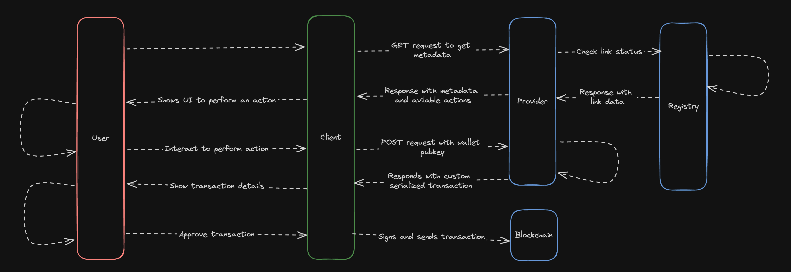
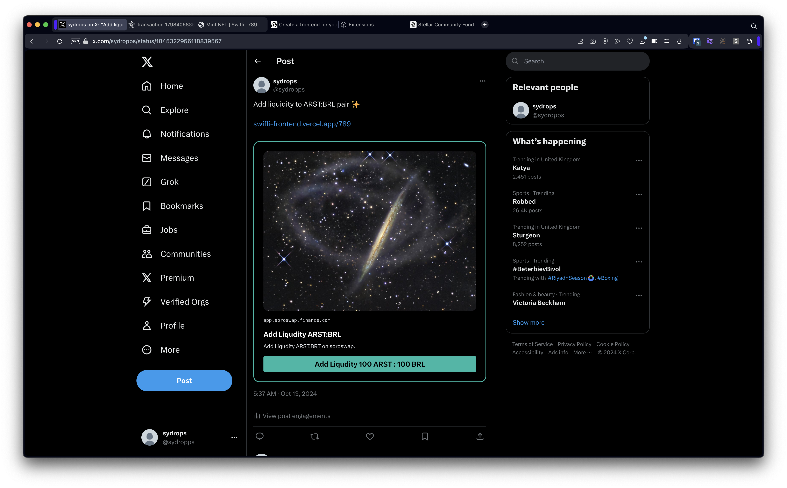
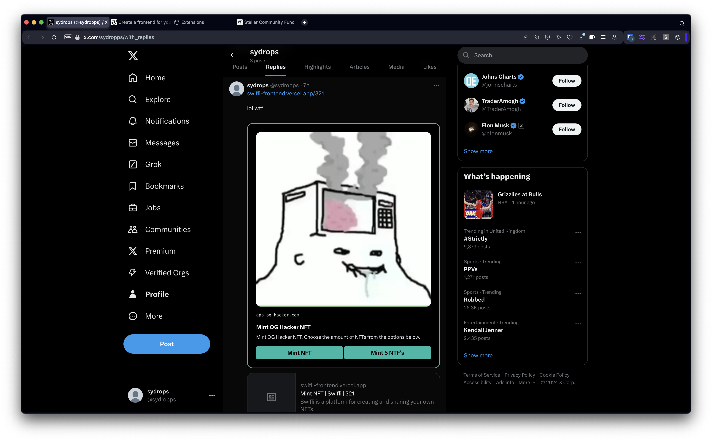
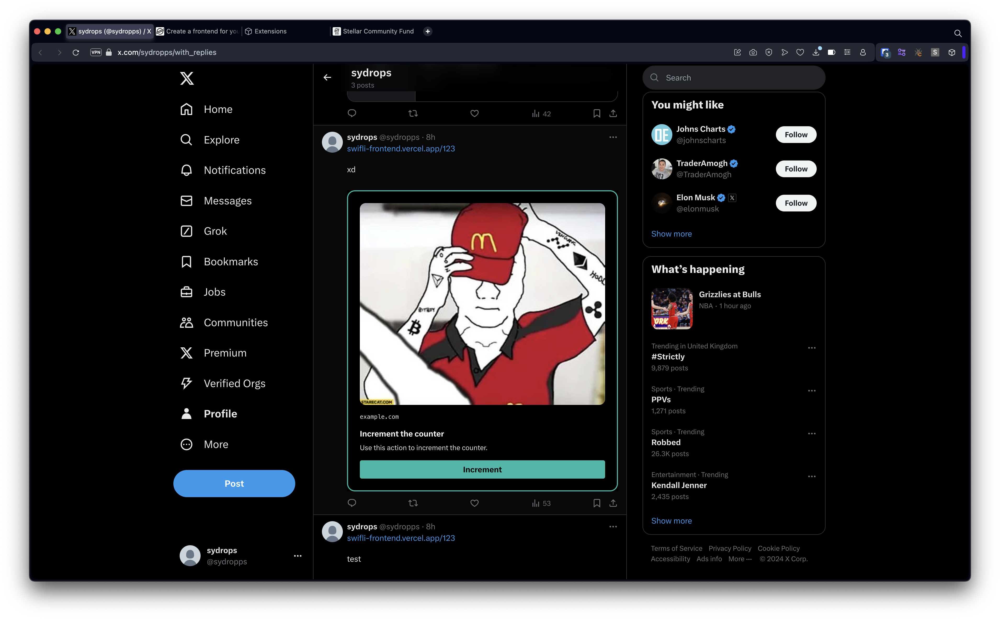
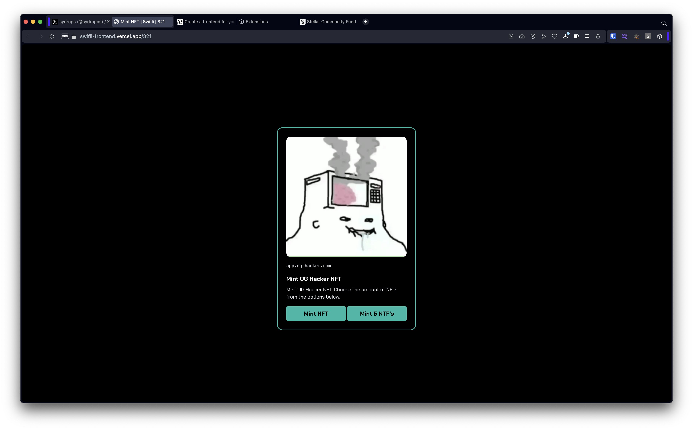
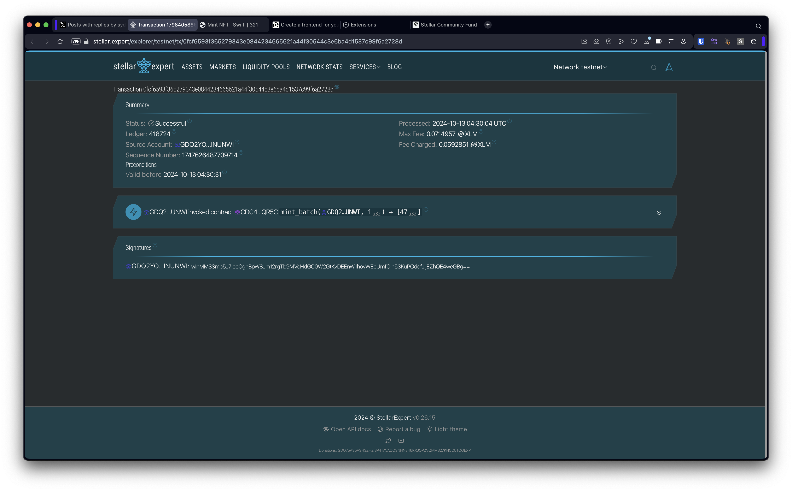
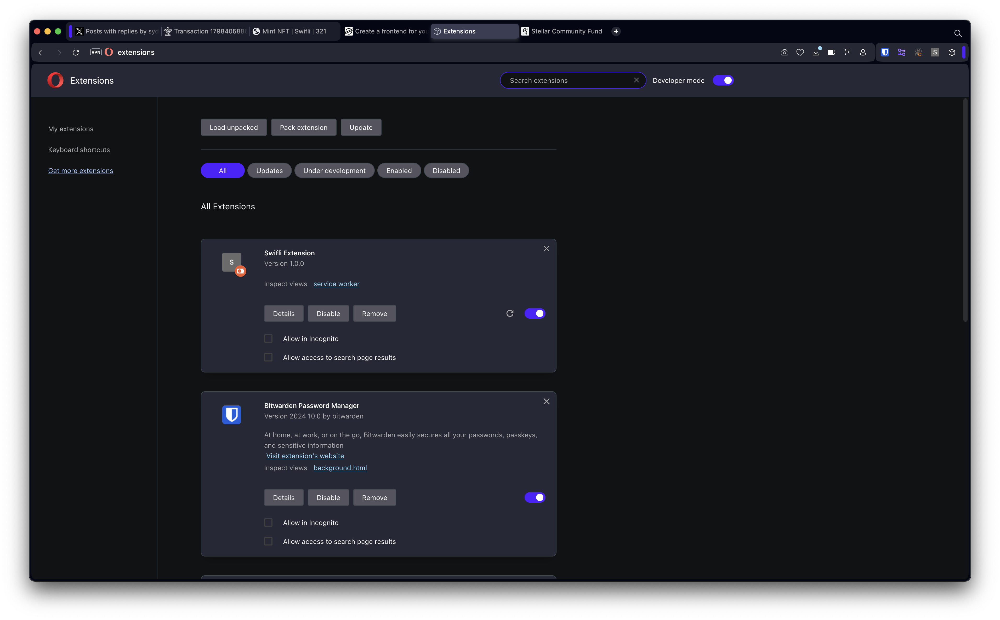

 
    
 

<strong style="font-size: 24px;">Web Links to Web3 Actions.</strong>

    
        
    

---

### What is Swifli?

Swifli is an innovative protocol designed to bridge the gap between traditional web experiences and blockchain capabilities. By encoding complex blockchain operations into simple, shareable URLs, Swifli democratizes access to various functionalities, such as DeFi and NFT management on the Stellar network.

The protocol supports both Stellar-native wallets, like Freighter, and Passkeys, ensuring accessibility for both experienced blockchain users and newcomers alike. If users do not have our extension to decode Swifli links, we have a fallback page ready for seamless interactions. Swifli empowers users to execute a range of blockchain actions effortlessly, including trading on DEXs, providing liquidity, minting NFTs, and interacting with smart contracts, all through familiar web interfaces.

The platform also incorporates a robust registry for verified and safe-to-interact links, coupled with a fallback mechanism for users without the Swifli extension, ensuring a smooth and secure experience across various scenarios. Through its innovative approach, Swifli is paving the way for the widespread adoption of blockchain technologies, making complex operations as simple as clicking a link and opening new possibilities for decentralized applications in the digital era.

### Features

- **URL Scheme**: Custom URL scheme that encodes web3 actions into standard web links.
- **Stellar Integration**: Leverages Stellar's speed and low fees for efficient blockchain transactions.
- **Astro Frontend**: Slick and responsive user interface built with the Astro framework.
- **Soroban Smart Contracts**: Utilizes Stellar's new smart contract platform for advanced operations like NFT minting.
- **Freighter Wallet Integration**: Seamless user authentication and transaction signing.
- **Passkeys**: Secure and easy-to-use authentication method for non-native users.

### Architecture

### Demo

[Loom Demo]()

### Platform Live

[Live Demo - Fallback platform for users without Swifli extension](https://swifli.23stud.io/987)

[Live Demo - Example of a Swifli link on X (Twitter)](https://x.com/sydropps/status/1845323961367728597)

### Presentation

[Presentation](https://www.canva.com/design/DAGTZAzVdAk/jOuua7dD-ja-6QcXNUwSZw/edit?utm_content=DAGTZAzVdAk&utm_campaign=designshare&utm_medium=link2&utm_source=sharebutton)

### Images

### Roadmap

- [x] Develop core protocol for transforming web links into web3 actions
- [x] Create registry platform for verified and safe-to-interact blinks
- [x] Develop browser extension for link detection and action execution on X (Twitter)
- [x] Implement fallback platform for users without Swifli extension installed
- [x] Create NFT smart contract as a showcase for interactions
- [x] Develop DEX interaction examples (add liquidity, swap)
- [x] Implement backend service for creating transactions and returning Swifli link data
- [ ] Expand browser extension support to other major social media platforms
- [ ] Enhance Stellar SDK integration for broader blockchain interactions
- [ ] Develop API for developers to create custom Swifli actions
- [ ] Create documentation and developer tools for integrating Swifli
- [ ] Implement support for multiple Stellar-compatible wallet providers
- [ ] Develop dashboard for users to manage and track their Swifli interactions
- [ ] Create analytics system for tracking usage and performance metrics
- [ ] Develop partnerships with major web platforms for native Swifli support
- [ ] Implement support for complex multi-step Stellar-based actions
- [ ] Create no-code user-friendly interface for creating Swifli links
- [ ] Implement privacy features for confidential transactions
- [ ] Create mobile app for Swifli interactions on smartphones
- [ ] Implement governance system for community-driven protocol upgrades

### Source Code

- [swiftly-smart-contract](https://github.com/hackers-boiz/swiftly-smart-contract)
- [swifly-backend](https://github.com/hackers-boiz/swifly-backend)
- [swifly-verification](https://github.com/hackers-boiz/swifly-verification)
- [swifli-frontend](https://github.com/hackers-boiz/swifli-frontend)
- [swifli-extension](https://github.com/hackers-boiz/swifli-extension)

### Attributions & Resources

- [Soroban](https://soroban.stellar.org)
- [Dialect](https://docs.dialect.to/documentation/actions/quick-start)
- [Solana Actions](https://solana.com/docs/advanced/actions)
